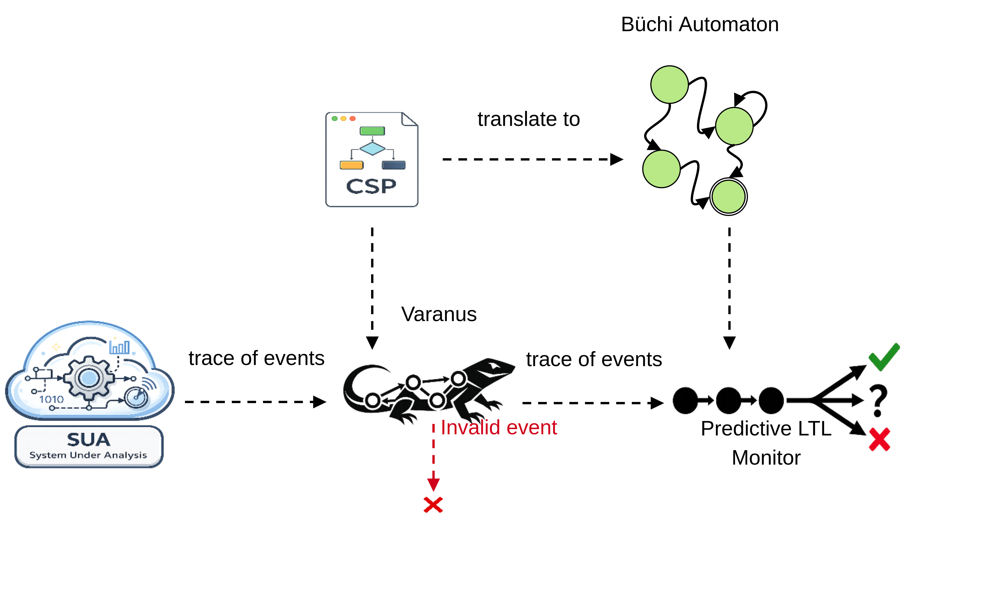

# PredictiveVaranus

Varanus-first predictive runtime verification for LTL over event streams.

This repository runs a two-layer decision pipeline:

1. **Varanus conformance gate** (CSP consistency check)
2. **Predictive LTL monitor** (model-constrained 3-valued verdict)

Only events accepted by Varanus are evaluated by predictive LTL.

## Core Libraries

This project builds on:

- **Varanus**: CSP-based runtime verification framework used as the conformance gate.  
  https://github.com/autonomy-and-verification/varanus
- **Spot**: automata and LTL toolkit used to build and run the predictive LTL monitor.  
  https://spot.lre.epita.fr/

## Architecture

<p align="center">
  
</p>

Runtime flow:

`event producer -> monitor.py (ws) -> Varanus gate (ws) -> predictive LTL -> merged verdict`

Default websocket endpoints:

- Predictive monitor: `ws://127.0.0.1:5088`
- Varanus gate: `ws://127.0.0.1:5087`

Producers must connect to the predictive endpoint (`5088` by default), not directly to Varanus.

## Repository Layout

- `monitor.py`: main orchestrator (offline and online)
- `hoa_projection.py`: HOA/AP projection utilities
- `predictive_ltl.py`: predictive LTL runtime core and standalone CLI
- `experiments/`: reproducible benchmark harness for the rover and synthetic evaluations
- `README_experiments.md`: benchmark setup, commands, outputs, and methodology notes
- `ARTIFACT.md`: compact artifact guide for reproducing benchmark inputs and outputs

## Requirements

- Linux
- Python 3 for this repository
- Python packages:
  - `spot`
  - `buddy`
  - `websockets`
- A Varanus checkout containing `varanus.py`
- A Python executable compatible with your Varanus/FDR setup (`--varanus-python`)

Quick import check:

```bash
python3 - <<'PY'
import spot, buddy, websockets
print("ok")
PY
```

## Usage

### Online Mode

```bash
python3 monitor.py <config.yaml> "<ltl_formula>" \
  --online \
  --host 0.0.0.0 --port 5088 \
  --varanus-script <path/to/varanus.py> \
  --varanus-python <python-for-varanus>
```

Expected startup lines:

- `Standalone Varanus gate started ...`
- `Gateway id: ...`
- `Online predictive monitor listening on ...`
- `Waiting for events. Each event will print as: [EVENT N] ...`

### Offline Mode

Offline is default unless `--online` is provided.

```bash
python3 monitor.py <config.yaml> "<ltl_formula>" <trace.txt> \
  --varanus-script <path/to/varanus.py> \
  --varanus-python <python-for-varanus>
```

Offline output ends with a `RES:` summary.

### Diagnostics

- `--debug`: pipeline metadata and per-step predictive reasons
- `--verbose-varanus`: stream full Varanus output to terminal
- `--verbose`: enables both `--debug` and `--verbose-varanus`

CLI help:

```bash
python3 monitor.py -h
```

## Generated Artifacts

Each run regenerates:

- source HOA from Varanus (typically `automaton.hoa` or `buchi_automaton.hoa`)
- `automaton_projected.hoa` (AP-projected HOA)
- `event_projection_map.json`
- `log/varanus_buchi.log` and `log/varanus_online.log` (unless `--verbose-varanus`)

`event_projection_map.json` format:

```json
{
  "ap_order": ["..."],
  "projection_map": {
    "domain_event": "pN"
  }
}
```

## Event and Verdict Output

Per accepted event, console summary follows this shape:

```text
[EVENT N] topic=<...> parsed=<...> ... varanus=<...> ltl=<true|false|?> final=<...> source=<varanus|ltl> reason=<...>
```

Field meaning:

- `varanus`: conformance verdict from gate
- `ltl`: predictive verdict from LTL runtime
- `final`: merged verdict returned to producer
- `source`: subsystem that decided `final`
- `reason`: diagnostic reason (`undecided`, `varanus_rejected_or_ignored`, etc.)

Typical online response payload includes:

- `verdict`
- `decision_source`
- nested `varanus` reply
- `projected_event`
- `predictive_verdict` / `ltl_verdict`
- `predictive_reason`

## Current Semantics Notes

### 1) Varanus remains the parser/conformance layer

PredictiveVaranus expects parsed events from Varanus (`parsed_event` and/or `event`) and applies predictive LTL on top.

### 2) Terminal stuttering proposition (`tick`)

The model side now uses a dedicated AP `tick` for post-termination stuttering in exported Büchi automata:

- normal visible transitions are encoded with `!tick`
- terminal stuttering self-loops use `tick`

This avoids the older over-permissive `[true]` stutter behavior after termination.

### 3) Formula-writing implication

For finite-run intent on top of infinite-word LTL, users may guard formulas with `tick`, for example:

- safety style: `G(!tick -> p)`
- eventuality-before-end style: `F(!tick & p)`

(If you keep plain LTL without guards, semantics are still infinite-word semantics.)

## Troubleshooting

### No `[EVENT ...]` lines

- Ensure producer is connected to predictive endpoint (`--host/--port`)
- Ensure predictive monitor startup completed
- Ensure Varanus online gate is running on expected host/port

### `missing_parsed_event`

- Varanus websocket reply did not include parsed event fields
- Check Varanus integration and mapping in its monitor callback

### Spot parse failure on projected HOA

- Run with `--verbose` to print line-level diagnostics
- Inspect `automaton_projected.hoa` and the printed offending lines

### Immediate unexpected LTL `false`

- Verify you are using freshly generated `buchi_automaton.hoa` and `automaton_projected.hoa`
- Confirm startup logs show the expected formula projection and AP list
- Check whether the prefix already forced a model branch where the formula is impossible

### ROS-side callback crash (`MonitorError` / `m_topic`)

If using ROS bridge code, a crash like:

- `AttributeError: 'MonitorError' object has no attribute 'm_topic'`

is in the ROS package message-field handling, not in PredictiveVaranus core.

## Standalone Tools

### HOA projection utility

```bash
python3 hoa_projection.py -h
```

Example:

```bash
python3 hoa_projection.py <input.hoa> \
  --trace <trace.txt> \
  --hoa-output <projected.hoa> \
  --trace-output <projected_trace.txt> \
  --map-output <event_projection_map.json>
```

### Predictive LTL prototype utility

```bash
python3 predictive_ltl.py -h
```

Example:

```bash
python3 predictive_ltl.py "<projected_formula>" <projected_trace.txt> --model <projected.hoa>
```
